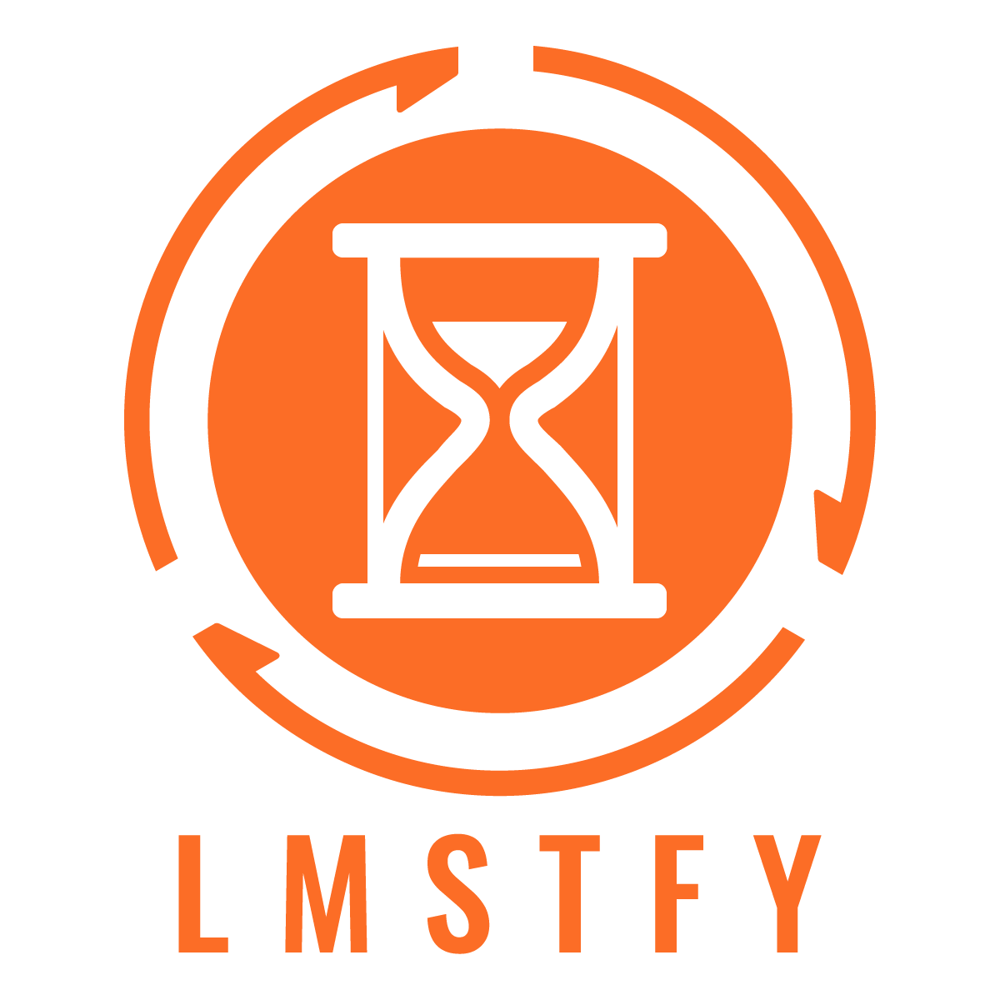

# LMSTFY(Let Me Schedule Task For You) 
[](https://github.com/bitleak/lmstfy/actions)  [](https://goreportcard.com/report/github.com/bitleak/lmstfy) [](https://codecov.io/gh/bitleak/lmstfy) [](https://github.com/bitleak/lmstfy/releases) [](https://github.com/bitleak/lmstfy/releases) [](https://github.com/bitleak/lmstfy/blob/master/LICENSE) [](https://godoc.org/github.com/bitleak/lmstfy)

lmstfy(pronounce /'lam.si.fai/) is a simple task queue (or job queue) service based on the Redis storage, providing the following features:

- basic job queue primitives: PUBLISH, CONSUME and DELETE via HTTP API
- support extra lifecycle management of jobs:
    * job TTL (time-to-live)
    * job delay trigger (at second granularity)
    * job auto-retry
    * dead letter
- namespace/queue level metrics
- token consume/produce rate limit

lmstfy itself doesn't handle data storage, it delegates the storage to the `Redis` or `Redis Sentinel` currently (a file based
storage backend is under implementing). So data integrity and durability is in the hand of redis,
we use AOF and replication on our production env to ensure that.

## Playing with Lmstfy 

If you just want to have a try, the `docker-compose` was highly recommended but DON'T use it in production. 
We would use docker-compose to setup and play with Lmstfy.

* Running the Redis and Lmstfy server 
```shell
# run the lmstfy and redis, server would listen on localhost:7777
# and admin port on localhost:7778.

% cd docker && docker-compose -p test-lmstfy up -d
```
* Create a new namespace and token
```shell
% curl -XPOST -d "description=test namesapce" "http://127.0.0.1:7778/token/test-ns" 
```

* Publish a new message
```shell
# The queue would be dynamic created, so feel free to publish the message to any queues.
# Below http request would create a job with delay = 1s, ttl = 3600s and tries = 16.

% curl -XPUT -H "X-token:{ENTER YOUR TOKEN}" "http://127.0.0.1:7777/api/test-ns/test-queue?delay=1&ttl=3600&tries=16" 
```

* Consume a job from the queue

```shell
% curl -H "X-token:{ENTER YOUR TOKEN}" "http://127.0.0.1:7777/api/test-ns/test-queue?ttr=30&timeout=2" 
```

* ACK the job
```shell
% curl -i -XDELETE -H "X-token:{ENTER YOUR TOKEN}" "http://127.0.0.1:7777/api/test-ns/test-queue/job/{YOUR JOB ID}" 
```

## Building Lmstfy

It is as simple as:

```shell
% make
```

The application binary would be generated at `_build` dir, you can run it on the `Running Lmstfy` section.

## Running Lmstfy

You must setup the Redis first and configure it in the lmstfy config file before running:

```
_build/lmstfy-server -c config/demo-conf.toml
```

## Internal

Detailed internal implementation looks like:


## Client drivers

* [Go](https://github.com/bitleak/lmstfy/tree/master/client) (The most stable and widely used)
* [PHP](https://github.com/bitleak/php-lmstfy-client)
* [Java](https://github.com/bitleak/java-lmstfy-client)
* [Rust](https://github.com/bitleak/rust-lmstfy-client)

## Documentation

* [HTTP API](https://github.com/bitleak/lmstfy/blob/master/doc/API.md)
* [Administration API](https://github.com/bitleak/lmstfy/blob/master/doc/administration.en.md)
* [Throttler API](https://github.com/bitleak/lmstfy/blob/master/doc/throttler.en.md)
* [Administration API Chinese](https://github.com/bitleak/lmstfy/blob/master/doc/administration.cn.md)
* [Throttler API Chinese](https://github.com/bitleak/lmstfy/blob/master/doc/throttler.cn.md)
* [Grafana](https://grafana.com/grafana/dashboards/12748)

## License
LMSTFY is under the MIT license. See the [LICENSE](https://github.com/bitleak/lmstfy/blob/master/LICENSE) file for details.
